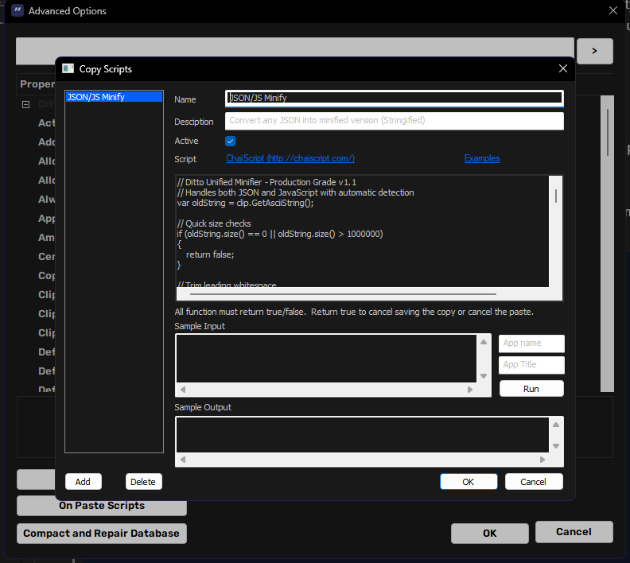

# Ditto ChaiScripts (JSON / JS Minifiers)

Small clipboard minifiers for [Ditto Clipboard Manager](https://github.com/sabrogden/Ditto).

This repo exists mainly to help people (especially **n8n users**) copy large JSON workflows or JavaScript snippets and paste them into AI tools (ChatGPT/Claude/etc.) with fewer wasted tokens.

Context / feature request in Ditto:

- https://github.com/sabrogden/Ditto/issues/1046

## What scripts are included

- [`UnifiedMinify.chai`](UnifiedMinify.chai) (recommended)
  - Automatically detects **JSON vs JavaScript** and runs the right minifier.
- [`JsonMinify.chai`](JsonMinify.chai)
  - JSON-only minifier.
- [`JSMinify.chai`](JSMinify.chai)
  - JavaScript-only minifier (tries hard to avoid running on JSON).

## Quick start (copy/paste into Ditto)

These scripts are designed to run as **On Copy** scripts.
If you prefer to keep the original (pretty) JSON in your Ditto history and only minify right before pasting into ChatGPT/Claude/etc., you can also use them as **On Paste** scripts.

1. Open **Ditto**.
2. Go to `Options` -> `Advanced` -> `On Copy Scripts`.
3. Add a new script.
4. Open [`UnifiedMinify.chai`](UnifiedMinify.chai) in this repo, copy all of it, and paste it into the Ditto script editor.
5. Enable the script and click `OK`.
6. Copy formatted JSON or JavaScript, then paste somewhere (Notepad is fine) to confirm it was minified.

Optional (On Paste setup):

1. Go to `Options` -> `Advanced` -> `On Paste Scripts`.
2. Add the script the same way (copy/paste contents).

Notes:

- Enable **only one** of these minifier scripts at a time (otherwise you may process the same text twice).
- Ditto scripting is **ASCII-only** (`clip.GetAsciiString()`), which is a Ditto/ChaiScript limitation.

## n8n: why this helps

n8n users frequently copy:

- Workflow exports (large JSON)
- Code/Function node snippets (JavaScript)

Pretty-printed JSON wastes AI tokens because whitespace becomes tokens. Minifying often reduces the size of workflow JSON dramatically (commonly 40-60% smaller).

Example n8n workflow export:

1. Export workflow (JSON) in n8n.
2. Copy it.
3. Ditto minifies automatically.
4. Paste into ChatGPT/Claude to review or refactor the workflow.

## How the scripts behave (high level)

All scripts:

- Run locally inside Ditto.
- Modify only the clipboard text.
- Return `false` (so they do not cancel the copy operation).
- Intentionally skip content that is already compact (e.g., single line) to keep Ditto fast.

### `UnifiedMinify.chai`

- If the first non-whitespace character is `{` or `[`, it treats the clip as JSON.
- Otherwise it uses a small “JS score” (looks for things like `function`, `=>`, `const/let/var`, `class`, `import/export`, etc.).
- Preserves JavaScript comments (`//` and `/* */`) and supports shebangs.

Limits:

- Skips clips over ~1MB.

### `JsonMinify.chai`

- Intended for JSON only.
- Does basic brace/bracket balance validation, then applies a few regex replacements.

Limits:

- Skips clips over ~1MB.

### `JSMinify.chai`

- Intended for JavaScript only.
- Rejects content that starts with `{` or `[` to avoid JSON.
- Requires a minimum JS indicator score.

Limits:

- Skips clips over ~500KB.

## Troubleshooting

- If nothing changes when you copy
  - Ensure the script is enabled in `Options` -> `Advanced` -> `On Copy Scripts`.
  - Restart Ditto.

- If JSON doesn't minify
  - The first non-whitespace character must be `{` or `[`.
  - If it is already a single line, the script intentionally skips.

- If JavaScript doesn't minify
  - The snippet must contain enough JS indicators (`const`, `function`, `=>`, etc.).
  - If it is already a single line, the script intentionally skips.

## Security

These scripts:

- Do not make network requests.
- Do not write files.

## References

- Ditto scripting wiki: https://github.com/sabrogden/Ditto/wiki/Scripting

## License

MIT (see [LICENSE](LICENSE)).
